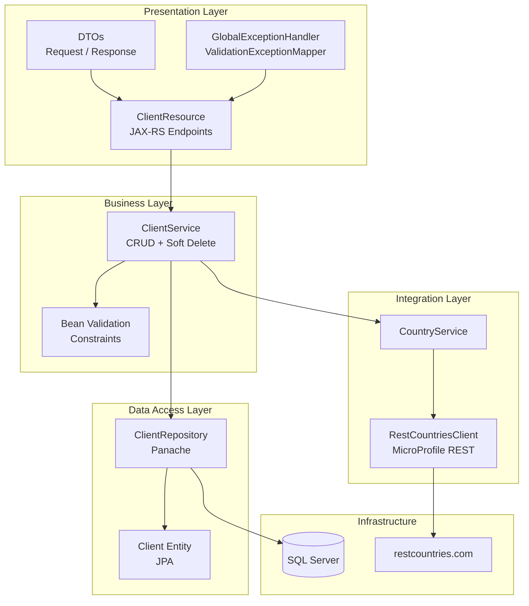

# Client Management API

A RESTful service for managing client information, built with Java and Quarkus framework.

## Table of Contents

- [Overview](#overview)
- [Features](#features)
- [Architecture](#architecture)
- [Technology Stack](#technology-stack)
- [Prerequisites](#prerequisites)
- [Installation](#installation)
- [Running the Application](#running-the-application)
- [API Documentation](#api-documentation)
- [Testing](#testing)
- [Project Structure](#project-structure)
- [Design Decisions](#design-decisions)

## Overview

This service provides a complete CRUD API for managing client data. It integrates with the [RestCountries API](https://restcountries.com) to automatically fetch demonym information and validate country codes using the ISO 3166-1 alpha-2 standard.

## Features

- **Create Client**: Add new clients with validation, duplicate detection, and automatic demonym fetching
- **Get All Clients**: Retrieve all active clients ordered by creation date
- **Get Clients by Country**: Filter clients by ISO 3166-1 alpha-2 country code
- **Get Client by ID**: Retrieve a specific client by UUID
- **Update Client**: Modify email, address, phone, and country (names cannot be changed after creation)
- **Soft Delete**: Deactivate a client without removing the record from the database
- **Country Code Validation**: Validates country codes against the RestCountries API
- **Duplicate Detection**: Prevents duplicate emails and phone numbers among active clients
- **Standardized Responses**: All endpoints return a consistent `ApiResponse` format
- **OpenAPI Documentation**: Interactive Swagger UI available at `/swagger-ui`

## Architecture

The application follows a layered architecture pattern:



For detailed diagrams see [`docs/ARCHITECTURE.md`](docs/ARCHITECTURE.md) and [`docs/diagrams/`](docs/diagrams/README.md).

## Technology Stack

| Component | Technology | Purpose |
|-----------|------------|---------|
| Framework | Quarkus 3.8.1 | Cloud-native Java framework |
| Language | Java 17 | Programming language |
| REST | RESTEasy Reactive | REST API implementation |
| ORM | Hibernate with Panache | Database operations |
| Validation | Hibernate Validator | Input validation |
| Database (Dev/Prod) | Microsoft SQL Server | Persistent relational database |
| Database (Test) | H2 | In-memory database for fast tests |
| REST Client | MicroProfile REST Client | External API calls (RestCountries) |
| Documentation | SmallRye OpenAPI | API documentation + Swagger UI |
| Testing | JUnit 5, Mockito, REST Assured | Unit and integration tests |

## Prerequisites

- **Java 17** or higher
- **Maven 3.8+** (or use the included `./mvnw` wrapper)
- **Docker** (for running SQL Server locally)

## Installation

1. **Clone the repository**:
   ```bash
   git clone <repository-url>
   cd client-management-api
   ```

2. **Build the project**:
   ```bash
   ./mvnw clean install
   ```

## Running the Application

### Development Mode

Run with hot-reload enabled:

```bash
./mvnw quarkus:dev
```

The application starts at `http://localhost:8080` connected to SQL Server. Make sure the database is running first (see below).

### SQL Server Setup (Docker)

```bash
docker run -d --name sql_server_container \
  -e "ACCEPT_EULA=Y" \
  -e "MSSQL_SA_PASSWORD=Admin123*" \
  -p 1433:1433 \
  mcr.microsoft.com/mssql/server:2022-latest
```

Then create the database:

```bash
docker exec -it sql_server_container /opt/mssql-tools/bin/sqlcmd \
  -S localhost -U sa -P "Admin123*" \
  -Q "CREATE DATABASE clientdb"
```

Hibernate will create the tables automatically on first run.


## API Documentation

### Endpoints

All endpoints are prefixed with `/api/v1/clients`. Clients are identified by UUID.

| Method | Endpoint | Description | Success |
|--------|----------|-------------|---------|
| POST | `/api/v1/clients` | Create a new client | 201 |
| GET | `/api/v1/clients` | Get all active clients | 200 |
| GET | `/api/v1/clients/{uuid}` | Get client by UUID | 200 |
| GET | `/api/v1/clients/country/{code}` | Get clients by country | 200 |
| PATCH | `/api/v1/clients/{uuid}` | Update client (email, address, phone, country) | 200 |
| DELETE | `/api/v1/clients/{uuid}` | Soft-delete client | 200 |
| GET | `/api/v1/clients/count` | Get active client count | 200 |

### Swagger UI

Access the interactive API documentation at: `http://localhost:8080/swagger-ui`

### Sample Requests

#### Create Client

```bash
curl -X POST http://localhost:8080/api/v1/clients \
  -H "Content-Type: application/json" \
  -d '{
    "firstName": "John",
    "secondName": "Michael",
    "firstSurname": "Doe",
    "secondSurname": "Smith",
    "email": "john.doe@example.com",
    "address": "123 Main Street, New York, NY 10001",
    "phone": "+1-555-123-4567",
    "countryCode": "US"
  }'
```

#### Get All Clients

```bash
curl http://localhost:8080/api/v1/clients
```

#### Get Client by UUID

```bash
curl http://localhost:8080/api/v1/clients/7b2a4e8f-3c1d-4a5b-9e6f-8d7c2b1a0e3f
```

#### Get Clients by Country

```bash
curl http://localhost:8080/api/v1/clients/country/US
```

#### Update Client

```bash
curl -X PATCH http://localhost:8080/api/v1/clients/7b2a4e8f-3c1d-4a5b-9e6f-8d7c2b1a0e3f \
  -H "Content-Type: application/json" \
  -d '{
    "email": "john.updated@example.com",
    "address": "456 New Avenue, Los Angeles, CA 90001",
    "phone": "+1-555-987-6543",
    "countryCode": "MX"
  }'
```

#### Soft-Delete Client

```bash
curl -X DELETE http://localhost:8080/api/v1/clients/7b2a4e8f-3c1d-4a5b-9e6f-8d7c2b1a0e3f
```

### Response Format

All responses follow the `ApiResponse` structure:

#### Success (201 Created)

```json
{
  "success": true,
  "message": "Client created successfully",
  "data": {
    "id": "7b2a4e8f-3c1d-4a5b-9e6f-8d7c2b1a0e3f",
    "firstName": "John",
    "secondName": "Michael",
    "firstSurname": "Doe",
    "secondSurname": "Smith",
    "fullName": "John Michael Doe Smith",
    "email": "john.doe@example.com",
    "address": "123 Main Street, New York, NY 10001",
    "phone": "+1-555-123-4567",
    "countryCode": "US",
    "demonym": "American",
    "active": true,
    "createdAt": "2026-02-20T22:17:38",
    "updatedAt": "2026-02-20T22:17:38"
  },
  "timestamp": "2026-02-20T22:17:38",
  "errors": null
}
```

#### Error (409 Conflict)

```json
{
  "success": false,
  "message": "A client with email 'john.doe@example.com' already exists",
  "data": null,
  "timestamp": "2026-02-20T22:18:00",
  "errors": null
}
```

#### Validation Error (400 Bad Request)

```json
{
  "success": false,
  "message": "Validation failed for one or more fields",
  "data": null,
  "timestamp": "2026-02-20T22:18:00",
  "errors": [
    {
      "field": "email",
      "message": "Email must be a valid email address",
      "rejectedValue": "invalid-email"
    }
  ]
}
```

## Testing

Tests use an H2 in-memory database -- no Docker or SQL Server needed to run tests.

```bash
./mvnw test
```

### Test Structure

- **`ClientServiceTest`** (24 tests): Unit tests for business logic with mocked repository and country service
  - Create, update, delete, get operations
  - Duplicate email/phone detection
  - Country code validation
  - Soft delete behavior

- **`ClientResourceTest`** (19 tests): Integration tests for REST endpoints
  - HTTP status codes for all operations
  - Request validation (missing fields, invalid formats)
  - Error responses (404, 409, 400)

**Total: 43 tests**

## Project Structure

```
client-management-api/
├── src/
│   ├── main/
│   │   ├── java/com/clientmanagement/
│   │   │   ├── client/               # External API integration
│   │   │   │   ├── CountryService.java
│   │   │   │   └── RestCountriesClient.java
│   │   │   ├── dto/
│   │   │   │   ├── client/           # Client-related DTOs
│   │   │   │   │   ├── ClientResponse.java
│   │   │   │   │   ├── CreateClientRequest.java
│   │   │   │   │   └── UpdateClientRequest.java
│   │   │   │   ├── common/           # Shared DTOs
│   │   │   │   │   ├── ApiResponse.java
│   │   │   │   │   ├── ErrorResponse.java
│   │   │   │   │   └── FieldError.java
│   │   │   │   └── country/          # Country API DTOs
│   │   │   │       ├── CountryData.java
│   │   │   │       ├── CountryName.java
│   │   │   │       ├── DemonymLang.java
│   │   │   │       └── Demonyms.java
│   │   │   ├── entity/
│   │   │   │   └── Client.java
│   │   │   ├── exception/
│   │   │   │   ├── ClientNotFoundException.java
│   │   │   │   ├── CountryServiceException.java
│   │   │   │   ├── DuplicateEmailException.java
│   │   │   │   ├── DuplicatePhoneException.java
│   │   │   │   ├── GlobalExceptionHandler.java
│   │   │   │   ├── InvalidCountryCodeException.java
│   │   │   │   └── ValidationExceptionMapper.java
│   │   │   ├── repository/
│   │   │   │   └── ClientRepository.java
│   │   │   ├── resource/
│   │   │   │   └── ClientResource.java
│   │   │   └── service/
│   │   │       └── ClientService.java
│   │   └── resources/
│   │       ├── application.properties
│   │       └── import.sql
│   └── test/
│       └── java/com/clientmanagement/
│           ├── resource/
│           │   └── ClientResourceTest.java
│           └── service/
│               └── ClientServiceTest.java
├── docs/
│   ├── ARCHITECTURE.md
│   └── diagrams/
│       ├── README.md
│       ├── architecture.mmd
│       ├── components.mmd
│       ├── database-schema.mmd
│       ├── flow-create-client.mmd
│       ├── flow-update-client.mmd
│       └── request-sequence.mmd
├── postman/
│   └── Client_Management_API.postman_collection.json
├── pom.xml
├── mvnw
└── .gitignore
```

## Design Decisions

### 1. UUID as Public Identifier
Internal numeric IDs (`bigint`) are used for database performance, but clients only see UUIDs. This avoids exposing sequential IDs and is safer for external APIs.

### 2. Soft Delete
Deleting a client sets `active = false` instead of removing the row. This preserves history and allows email/phone reuse for deactivated records. All queries filter by `active = true`.

### 3. Country Code Validation
Country codes are validated against the RestCountries API before persisting. Invalid codes like "RD" are rejected with a 400 error. The demonym is fetched in the same call.

### 4. Duplicate Detection (Active Only)
Email and phone uniqueness is enforced only among active clients. This means a deactivated client's email can be reused by a new client.

### 5. Separate DTOs for Create/Update
- `CreateClientRequest`: All fields for new client
- `UpdateClientRequest`: Only modifiable fields (email, address, phone, country)

This enforces the business rule that names cannot be changed after creation.

### 6. Standardized API Response
All endpoints return `ApiResponse<T>` with `success`, `message`, `data`, `timestamp`, and `errors` fields for consistency.

### 7. Database Strategy
- **SQL Server** for development and production (persistent, production-grade)
- **H2 in-memory** for tests (fast, no external dependencies)

### 8. Flush After Persist
`clientRepository.flush()` is called immediately after `persist()` to force database constraint violations to surface in the same request, avoiding silent failures.

## Health and Monitoring

- **Health Check**: `http://localhost:8080/health`
- **Liveness**: `http://localhost:8080/health/live`
- **Readiness**: `http://localhost:8080/health/ready`
