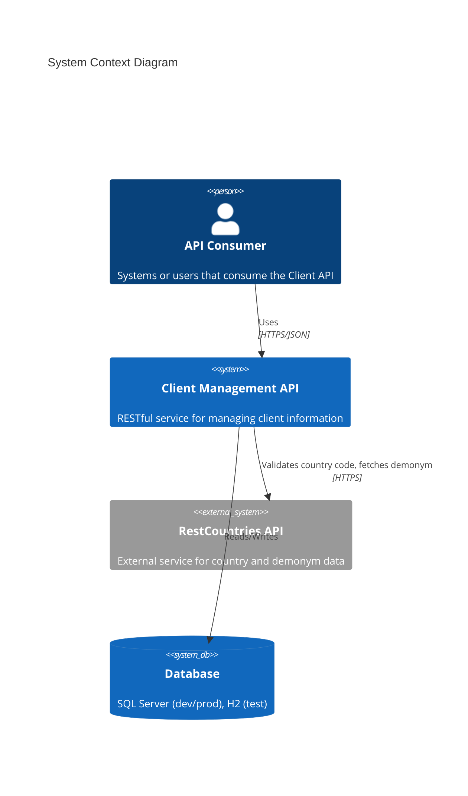
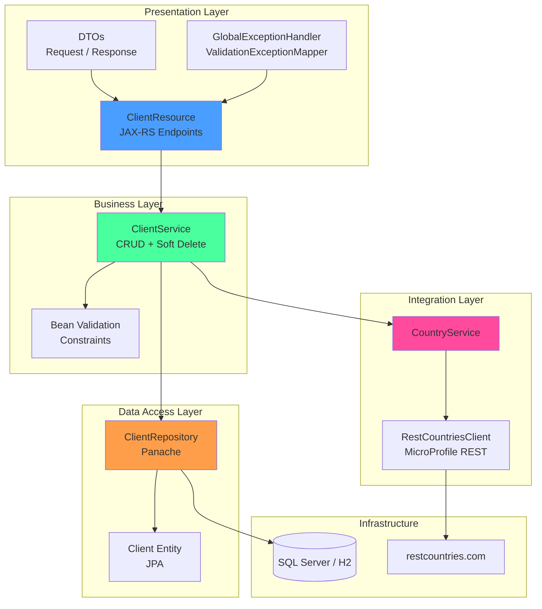
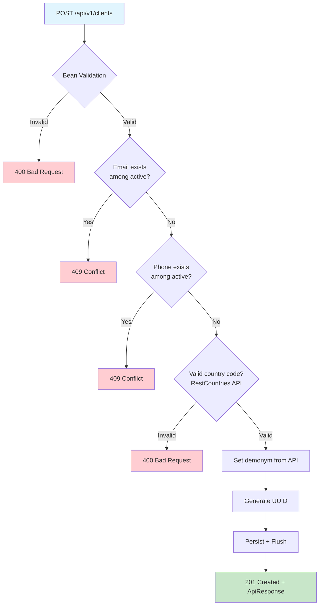
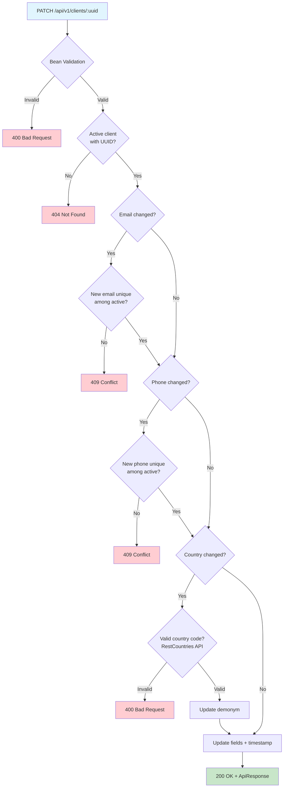
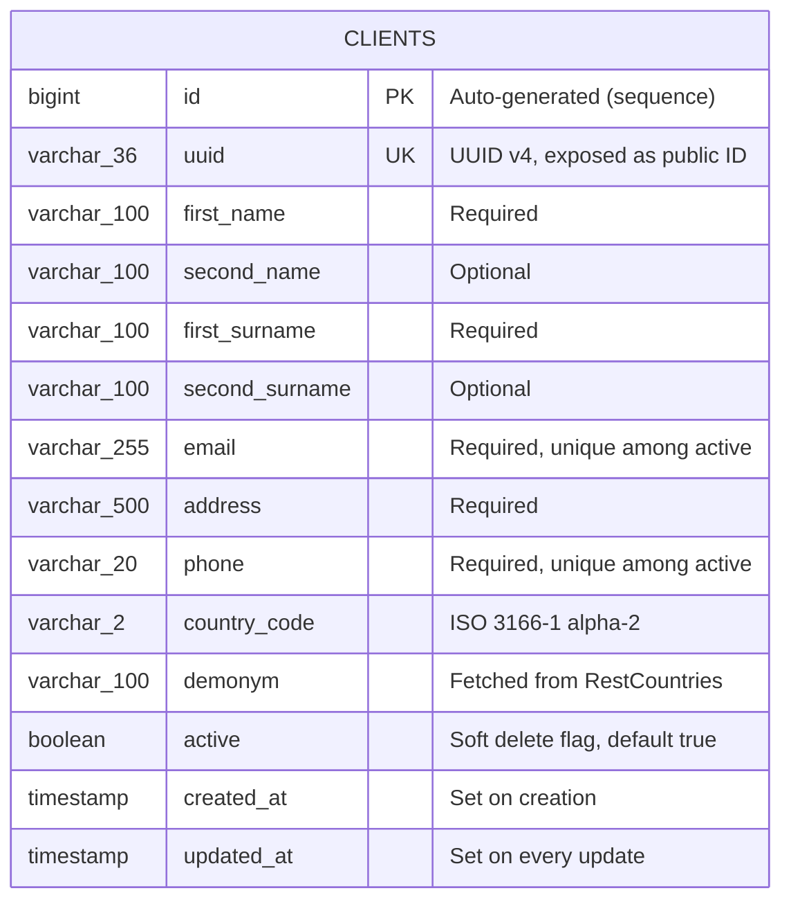

# Architecture Documentation

## Overview

This document describes the architecture of the Client Management API -- a RESTful service built with Quarkus for managing client information. It integrates with the RestCountries external API to fetch demonyms and validate country codes.

> Standalone Mermaid diagram files are available in [`docs/diagrams/`](diagrams/README.md) for reviewers who prefer to render them separately.

## System Context



## Layer Architecture



## Component Details

### Resource Layer

`ClientResource` exposes all REST endpoints under `/api/v1/clients`. Every response is wrapped in `ApiResponse<T>` for a consistent format. Input validation is handled by Bean Validation annotations on the DTO classes.

### Service Layer

`ClientService` contains the business logic:
- Duplicate checks for email and phone (only among active clients)
- Country code validation via `CountryService` before persisting
- Soft delete (sets `active = false` instead of removing the row)

`CountryService` wraps the RestCountries external API to fetch demonyms and validate ISO 3166-1 alpha-2 country codes.

### Repository Layer

`ClientRepository` extends Panache's `PanacheRepository<Client>` and adds custom queries. All retrieval methods filter by `active = true` so soft-deleted clients are excluded.

### Exception Handling

`GlobalExceptionHandler` maps domain exceptions to HTTP status codes:

| Exception | HTTP Status |
|-----------|-------------|
| `ClientNotFoundException` | 404 Not Found |
| `DuplicateEmailException` | 409 Conflict |
| `DuplicatePhoneException` | 409 Conflict |
| `InvalidCountryCodeException` | 400 Bad Request |
| `CountryServiceException` | 503 Service Unavailable |
| `ConstraintViolationException` | 400 Bad Request |
| `PersistenceException` | 409 Conflict |

## Data Flow

### Create Client



### Update Client



### Soft Delete

Deleting a client sets `active = false` and updates the timestamp. The row stays in the database but is excluded from all queries. This allows email/phone reuse after deactivation.

## Database Schema



## API Endpoints

| Method | Path | Description | Success |
|--------|------|-------------|---------|
| POST | `/api/v1/clients` | Create a new client | 201 |
| GET | `/api/v1/clients` | List all active clients | 200 |
| GET | `/api/v1/clients/{uuid}` | Get client by UUID | 200 |
| GET | `/api/v1/clients/country/{code}` | Filter by country code | 200 |
| PATCH | `/api/v1/clients/{uuid}` | Update client (email, address, phone, country) | 200 |
| DELETE | `/api/v1/clients/{uuid}` | Soft-delete client | 200 |
| GET | `/api/v1/clients/count` | Count active clients | 200 |

All responses follow the `ApiResponse` format:

```json
{
  "success": true,
  "message": "Clients retrieved successfully",
  "data": [ ... ],
  "timestamp": "2026-02-20T22:17:38",
  "errors": null
}
```

## Deployment

### Development / Test

Development connects to SQL Server via Docker. Tests use an H2 in-memory database so no Docker is needed to run `mvn test`.

```
mvn quarkus:dev     # starts on http://localhost:8080
mvn test            # runs 43 unit/integration tests against H2
```


## Design Decisions

1. **UUID as public ID** -- Internal `bigint` IDs stay in the database; clients only see UUIDs. This avoids exposing sequential IDs.
2. **Soft delete** -- Setting `active = false` preserves audit history and allows email/phone reuse for deactivated records.
3. **Flush after persist** -- Calling `flush()` immediately after `persist()` forces constraint violations to surface in the same request instead of silently failing.
4. **Country validation before update** -- When the country code changes, the demonym is fetched first. If the code is invalid, the exception fires before any field is modified.
5. **SQL Server for dev/prod, H2 for tests** -- SQL Server provides a production-grade database. H2 keeps tests fast and independent of external services.

---
